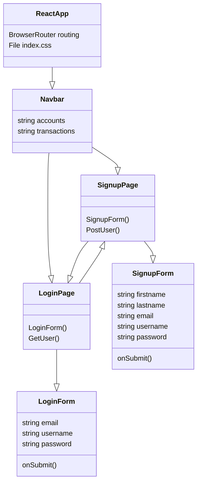

# BudgetApp

```mermaid
classDiagram
 ReactApp : BrowserRouter routing
ReactApp : File index.css
ReactApp --|> Navbar
Navbar --|> SignupPage
Navbar --|> LoginPage
SignupPage --|> SignupForm
SignupPage --|> LoginPage
LoginPage --|> SignupPage
LoginPage --|> LoginForm
class Navbar{
string accounts
string transactions
}
class SignupPage{
SignupForm()
PostUser()
}
class SignupForm {
string firstname
string lastname
string email
string username
string password
onSubmit()
}
class LoginPage{
LoginForm()
GetUser()
}
class LoginForm {
string email
string username
string password
onSubmit()
}
```
