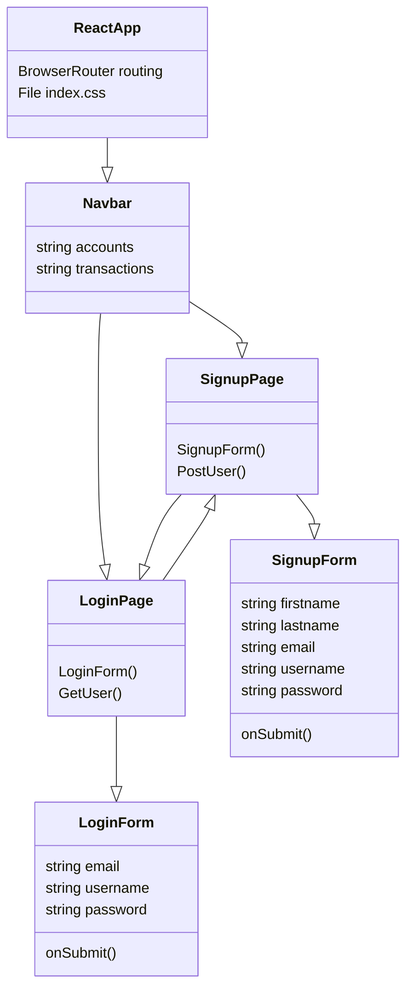
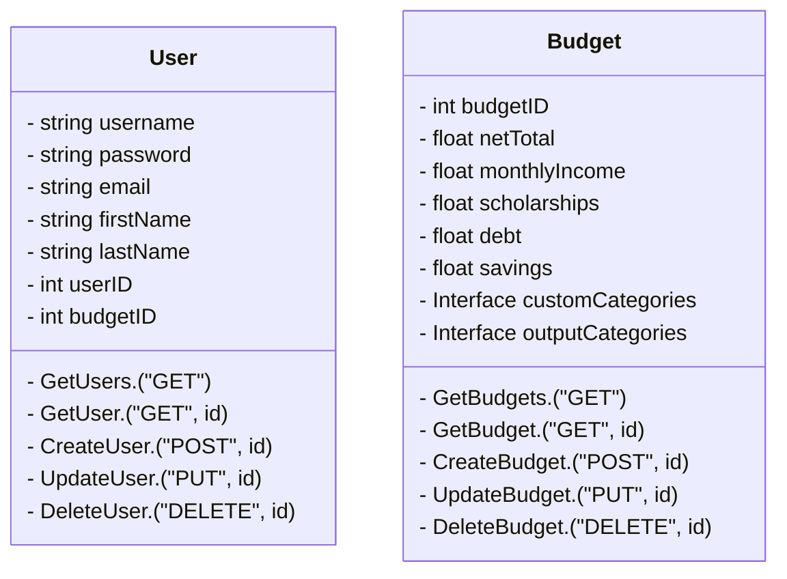

# BudgetApp

## To Do List

### Backend

- Finish User and Budget models and routes (will be difficult for budget)
- Set up a remote Mongo database
- Link frontend and backend

### Frontend

- Make working signup page with user model
- Make interface for budgeting categories
- Clean up the home page (ideally the rest too)

## Frontend Design

## Backend Design

